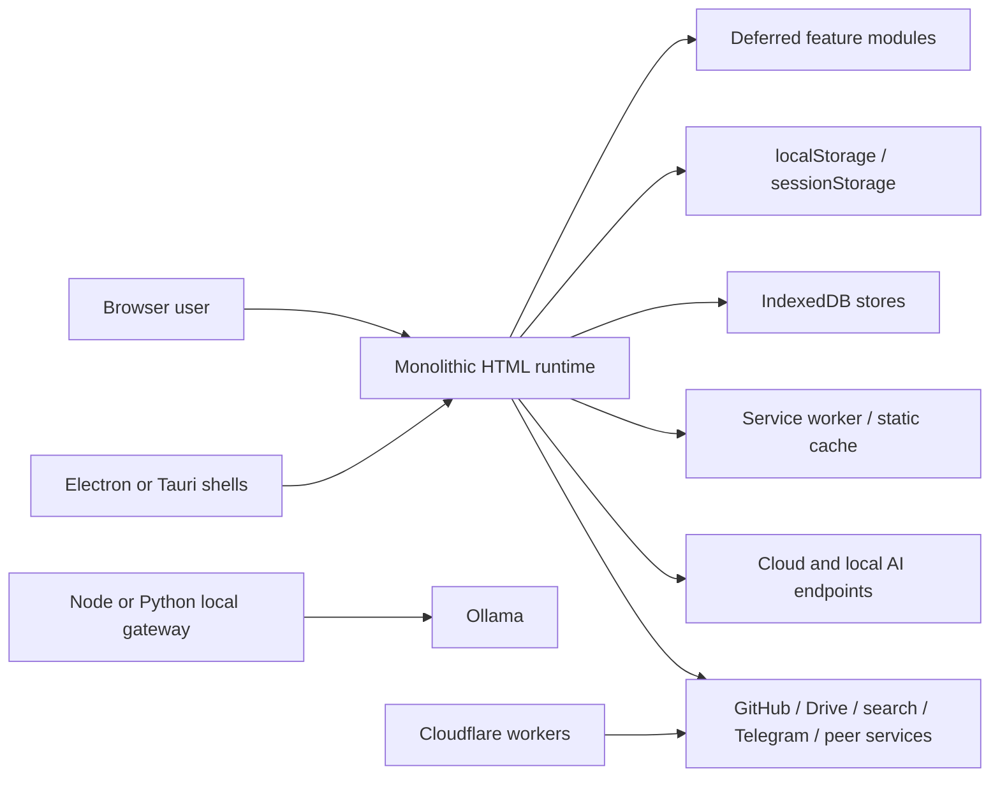
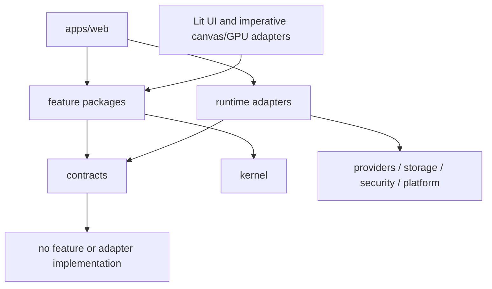
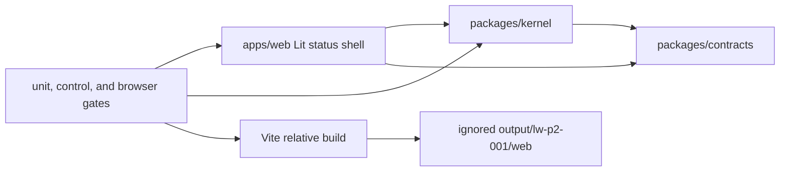
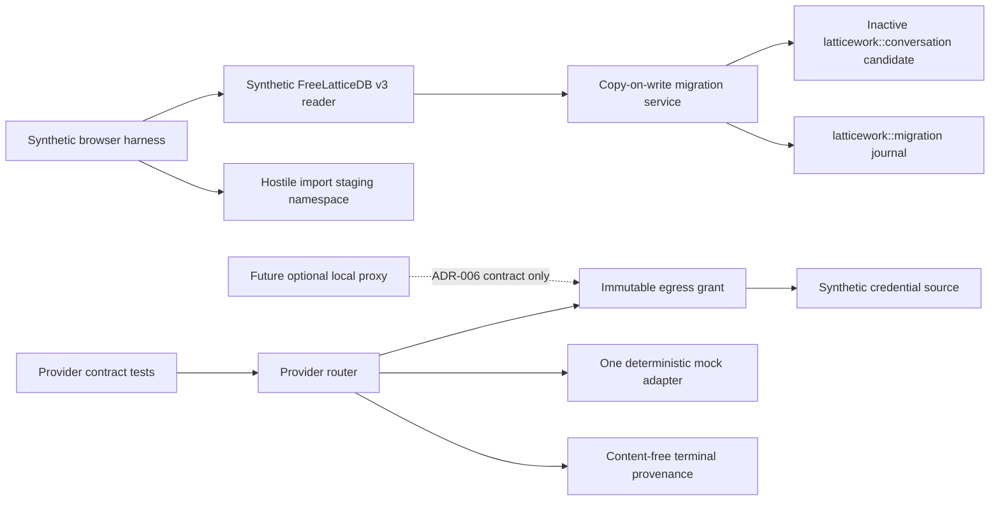

<!-- Status: LIVING | Owner: Architecture lead -->

# Architecture

## Status

`ACCEPTED TARGET / PHASE 3 SYNTHETIC-MOCK FOUNDATION IMPLEMENTED / FINAL EVIDENCE PENDING`

This document must describe implemented reality and clearly separate current state from target state.

## System context

Document:

- User and operator roles.
- Browser runtime.
- Local AI endpoints.
- Cloud AI providers.
- Persistence.
- Service worker.
- Peer-to-peer transport.
- Static hosting.
- Build and test tooling.
- External repositories or coordination surfaces.

## Current upstream architecture

### Runtime composition

**OBSERVED:**

The diagram is a source-level boundary map, not proof that every edge is live.

### Major source surfaces

| Surface | Responsibility | Inputs | Outputs | State | Dependencies | Tests |
|---|---|---|---|---|---|---|
| `docs/app.html` / `index.html` | Apparent deployed browser application | User input, files, provider responses | DOM, network requests, stored records | Globals, Web Storage, IndexedDB | modules, browser APIs, remote/local endpoints | legacy smoke plus bounded Phase 1 browser characterization |
| root `app.html` | Divergent browser application variant | Similar, not yet reconciled | DOM and side effects | Globals and browser storage | browser/platform APIs | source assertions only |
| `docs/modules/*.js` / `modules/*.js` | Feature extensions | globals/events/user actions | UI/state/network effects | mixed global and store ownership | primary runtime and browser APIs | smoke literals; no module contract suite |
| `server.js` / `server.py` | Static hosting and Ollama proxy | HTTP requests | static files/proxied responses | process configuration | filesystem, Ollama | no direct receipt |
| `sw.js` / `docs/sw.js` | PWA cache/update behavior | fetch/install/activate events | cached responses | Cache Storage | browser service worker | source assertions only |
| `desktop/` | Electron and Tauri shells | OS launch/user actions | desktop window/filesystem integration | desktop settings/files | Electron/Tauri | not executed |
| workers | Search, Telegram, and proxy functions | public/service requests | external requests/responses | deployed configuration | Cloudflare/external APIs | not executed |

### Current dependency direction

**INFERRED:** dependency direction is primarily global and load-order driven:
primary HTML defines state/services; feature modules read and mutate those globals;
storage, providers, network, crypto, and rendering are frequently called directly.
There is no proven module-level acyclic dependency graph.

### Current global state

**OBSERVED:** static inventory found 244 distinct assigned `window` symbols, 194
literal localStorage keys, two sessionStorage keys, nine IndexedDB database names,
and five extracted object-store names. See
`reengineering/evidence/phase-0/LW-M0-INV-001/`.

### Current implicit contracts

- Global assignment and script-load order.
- Root/`docs` mirror selection and service-worker scope.
- Existing storage keys, IndexedDB names, unknown fields, and import/export shapes.
- Provider request/stream/error semantics.
- Browser globals used by deferred feature modules.
- Direct-file, static HTTP, PWA, LAN, desktop, and worker entrypoints.
- Consent and authentication behavior at externally mutating boundaries.

### Current high-risk change surfaces

- The 65,387-line deployed runtime and divergent root application.
- Credential, crypto, identity, Core/Merkle, and user-data paths.
- Broad-bind/wildcard-CORS local gateways.
- PWA cache activation/rollback and stale-client behavior.
- Peer, GitHub, Drive, Telegram, search, wallet, and marketplace side effects.
- Competing Electron and Tauri implementations.

Evidence: [Phase 0 boundary map](../reengineering/evidence/phase-0/LW-M0-BEH-001/behavior-boundary-map.md).

## Target LATTICEWORK architecture

The target architecture must define:

- Layer boundaries.
- Domain or feature modules.
- Runtime interfaces.
- State ownership.
- Persistence adapters.
- Provider adapters.
- Event contracts.
- Rendering boundaries.
- Security boundaries.
- Test seams.
- Migration seams.
- Agent ownership surfaces.

### Accepted dependency rule

Higher-level features may depend on stable interfaces. Core contracts must not depend on feature-specific implementations.

**ACCEPTED 2026-07-30 — implementation remains bounded by work claims:**

See accepted ADRs
[`0001`](decisions/0001-canonical-source-and-build-strategy.md),
[`0002`](decisions/0002-typescript-module-architecture.md), and
[`0003`](decisions/0003-ui-rendering-strategy.md). Acceptance authorizes the
isolated `LW-P2-001` status-shell spike only; no legacy feature, route, provider,
or data behavior has been migrated.

### Implemented candidate foundation

**VERIFIED at `7e928bba605e0309273989bf8fd1303d2a822923`:**

- `packages/contracts` owns lifecycle, diagnostics, and status types.
- `packages/kernel` owns dependency-injected start/stop ordering, safe failure
  diagnostics, and status aggregation.
- `apps/web` renders a feature-free local status shell through Lit.
- The candidate writes only ignored build output; it imports no legacy runtime
  and touches no deployment mirror, durable browser state, provider, worker,
  desktop, GPU, audio, or external-service boundary.
- Canonical and independent verification prove this narrow dependency seam,
  deterministic build, and browser safety profile. They do not prove legacy
  feature parity or authorize a default-route switch.

### Accepted bounded Phase 3 storage/provider spine

**IMPLEMENTED IN THE BOUNDED `LW-P3-001` CANDIDATE — FINAL CANONICAL AND
INDEPENDENT EVIDENCE PENDING:**

- `packages/storage` implements the accepted synthetic `conversation`
  descriptor, injected read-only source reader, namespaced candidate
  repository, immutable terminal-failure journal, checkpointed/resumable
  copy-on-write migration, local-only source verification identity, automatic
  failed-candidate disposal, immutable operation/migration binding,
  ready-candidate revalidation, one shared fail-closed native structured-clone
  identity/equivalence contract, and exact disposable import staging. It has
  no activation API.
- `packages/providers` implements an injected router, immutable
  capability-bound egress grants, synthetic credential references,
  deterministic in-process adapter scripts, normalized stream/error/retry/
  deadline/cancellation behavior, and content-free provenance with explicit
  fallback-chain and retry-authorization fields. It has no transport or
  listener implementation.
- Native Chromium tests exercise only generated synthetic records and prove
  source/schema preservation, checkpoint resume, rollback, future-version
  abstention, hostile-import rejection, blocked upgrades, quota failure, and
  zero external egress.
- ADR-006 accepts an optional, disabled, loopback-only, authenticated and
  exactly allowlisted proxy boundary for later work. It does not authorize a
  listener. Broader LAN/worker/peer/Telegram behavior remains blocked by
  ADR-012.
- Activation, cleanup, legacy feature migration, route switching, and
  capability retirement remain future decisions. Cutover remains governed by
  future ADR-009.

The accepted decisions and executable scope controls live in
[`PHASE3_DECISION_PACKET.md`](../reengineering/PHASE3_DECISION_PACKET.md).
No feature imports or registers these packages. The implemented application
therefore remains the Phase 2 feature-free status shell; the new packages are
an unused, synthetic/mock-only architecture seam pending final Phase 3
evidence and later feature-specific work claims.

## Architecture invariants

- No feature may require editing an unrelated monolithic surface without an explicit reason.
- Persistence formats must be versioned.
- External-provider calls must pass through documented adapters.
- User data must have an owner, schema, and migration path.
- Global mutable state must be inventoried and justified.
- Security and privacy boundaries must be visible in code.
- Each boundary must have at least one verification mechanism.

## Architecture debt ledger

| ID | Debt | Evidence | Impact | Proposed boundary | Status |
|---|---|---|---|---|---|
| `ARCH-001` | Authored and deployed legacy sources remain divergent | [inventory](../reengineering/evidence/phase-0/LW-M0-INV-001/LW-M0-INV-001.md) | Drift and partial releases | generated artifact boundary | Open; candidate-only generated boundary verified, legacy cutover not started |
| `ARCH-002` | Legacy global/load-order coupling | [boundary map](../reengineering/evidence/phase-0/LW-M0-BEH-001/behavior-boundary-map.md) | Unsafe unrelated changes | typed contracts and compatibility adapters | Open; feature-free typed lifecycle seam verified, no legacy feature migrated |
| `ARCH-003` | Rendering, state, storage, providers, and security are mixed | [boundary map](../reengineering/evidence/phase-0/LW-M0-BEH-001/behavior-boundary-map.md) | Hard-to-characterize migrations | view-model and adapter seams | Open; ADR-002/003 accepted, feature migration not started |
| `ARCH-004` | Electron and Tauri overlap without a supported-platform decision | [legacy source map](../reengineering/LEGACY_SOURCE_MAP.md) | Double maintenance and unclear release claims | ADR-007 bounded spike | Open |
| `ARCH-005` | PWA and launch-mode compatibility are unverified | [compatibility contract](COMPATIBILITY.md) | Data/offline/rollback risk | ADR-008/009/011 | Open |
| `ARCH-006` | Most legacy storage owners/schemas and every real-data migration remain unverified | [Phase 3 packet](../reengineering/PHASE3_DECISION_PACKET.md) | Data loss or silent reinterpretation | accepted ADR-004 plus per-dataset descriptors | Open; one synthetic conversation repository/migration/staging seam is implemented, unused, and awaiting final evidence |
| `ARCH-007` | Real provider protocols, fallback compatibility, credentials, and proxy behavior remain uncharacterized | [Phase 3 packet](../reengineering/PHASE3_DECISION_PACKET.md) | Trust-boundary crossing and unprovable failures | accepted ADR-005/006 | Open; deterministic no-egress mock router/provenance seam is implemented, unused, and awaiting final evidence |
