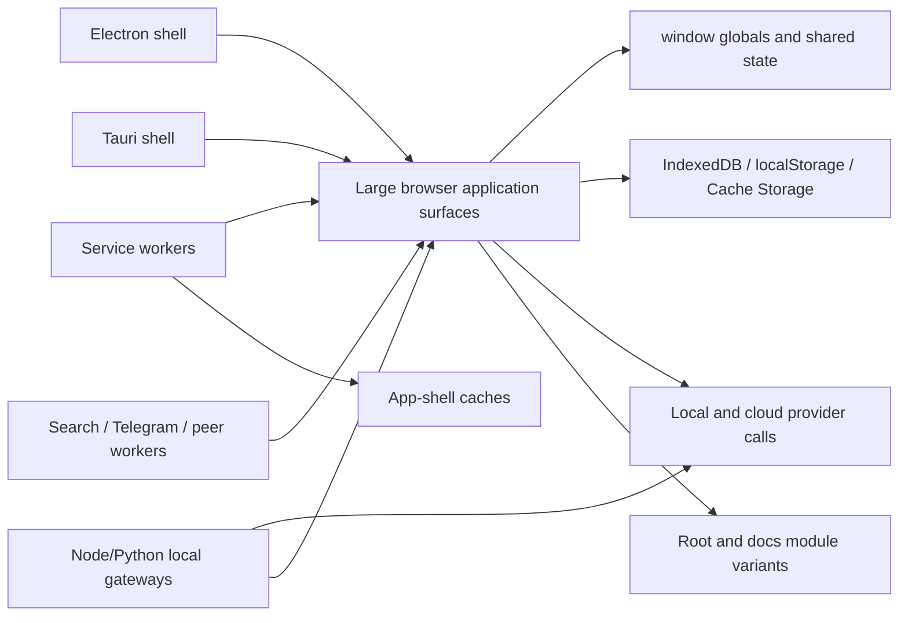
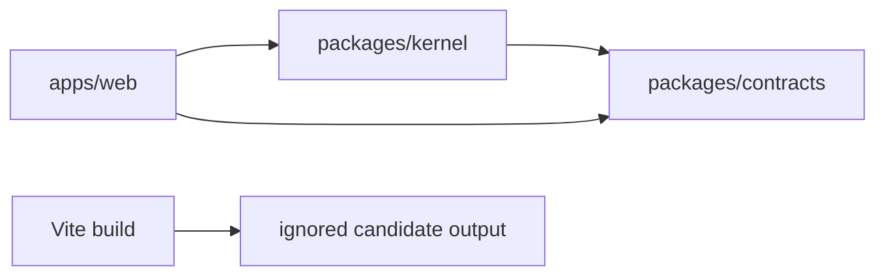

# Baseline Dependency Graph

**Status:** DISCOVERY

The graph remains a baseline summary. Phase 0 inventories now provide measured
path/symbol, storage, and network-boundary ownership; dynamic reachability and a
complete module-cycle graph remain unknown.

## Target dependency rule

Feature code depends on stable contracts. Contracts do not depend on feature implementations. UI code does not access durable storage or providers directly.

## Verified Phase 2 candidate seam

**VERIFIED:** this feature-free seam has no provider, storage, service-worker,
legacy-runtime, or external-service dependency in the bounded source and
browser gates. It is not yet a feature migration graph.
