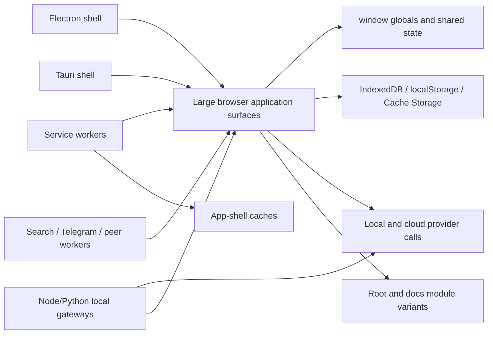

# Baseline Dependency Graph

**Status:** DISCOVERY

The graph is preliminary. Phase 0 evidence must replace each broad node with measured path/symbol ownership and identify cycles, direct globals, direct storage calls, and network edges.

## Target dependency rule

Feature code depends on stable contracts. Contracts do not depend on feature implementations. UI code does not access durable storage or providers directly.
