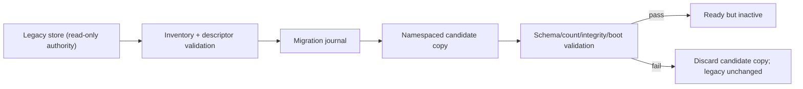
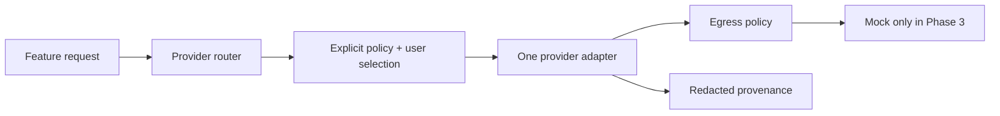

# Phase 3 Decision Packet — `LW-P3-DEC-001`

**Status:** PROPOSED — MAINTAINER DISPOSITION REQUIRED
**Date:** 2026-07-30
**Base commit:** `6704dd502a140fce2fe8e06f8db336d0bd3839a5`
**Runtime changes authorized:** No

## Purpose

This packet turns the three choices required before the storage/provider spine
into reviewable contracts:

1. [ADR-004](../docs/decisions/0004-versioned-storage-and-migration.md):
   preserve legacy stores and migrate one dataset at a time into a separate,
   namespaced, journaled, copy-on-write repository.
2. [ADR-005](../docs/decisions/0005-provider-abstraction-and-provenance.md):
   separate provider wire adapters from routing/fallback policy, require
   cancellation/error semantics and redacted provenance, and use only mocks in
   Phase 3.
3. [ADR-006](../docs/decisions/0006-optional-local-proxy-security.md):
   keep any proxy optional and disabled by default; require explicit loopback
   binding, pairing/authentication, exact origins/routes/upstreams, limits, and
   content-free diagnostics.

The machine-readable control surface is
[`PHASE3_DECISION_PACKET.json`](PHASE3_DECISION_PACKET.json).

<!-- BEGIN PHASE3 STRUCTURED CONTRACT SUMMARY -->
- Storage: dataset `conversation` schema `1` targets `latticework::conversation`; owned legacy stores are `conversations`, `messages`; staging uses `latticework::staging::<operation-id>::<dataset-id>`.
- Exclusions: credentials, device-derived-key-material, identity-and-cryptography, wallet-and-chain, session-only-tokens, cache-storage, desktop-state, remote-state are legacy-parse-only with no Phase 3 copy or export writer.
- Rollback: close then delete or quarantine only the exact candidate dataset namespace; retain an immutable terminal journal receipt; leave legacy state untouched.
- Provider: deterministic mocks only; one wire attempt per adapter invocation; router-owned zero-default retry; stable operation ID and unique attempt ID; no real credentials or traffic.
- Credentials: an immutable egress grant and exact provider, adapter, origin, trust-class, and authentication-scheme binding are required before resolution.
- Proxy: no Phase 3 listener; disabled by default; loopback only; pairing bootstrap is exact-origin, non-GET, single-use, short-lived, rate-limited, upstream-free, and sanitized.
<!-- END PHASE3 STRUCTURED CONTRACT SUMMARY -->

## Evidence summary

- **OBSERVED:** the 252 baseline data-preservation rows remain unresolved and
  owner-removal-gated; newly discovered rows must extend rather than replace
  that floor.
- **OBSERVED:** a fresh run created 17 IndexedDB databases and 24 stores, while
  static extraction found additional stores, keys, and computed names.
- **OBSERVED:** legacy backup/restore formats are heterogeneous and generic
  restore is not atomic or rollback-proven.
- **OBSERVED:** primary Chat and module AI calls have different request,
  streaming, fallback, persistence, and error behavior.
- **OBSERVED:** legacy helpers use broad bind/wildcard CORS without a
  characterized authentication boundary.
- **VERIFIED:** the Phase 2 candidate has no provider, storage, worker,
  service-worker, route, or external-service behavior.

These observations establish decision pressure, not permission to mutate the
system.

## Proposed bounded Phase 3 execution

Only after ADR-004 and ADR-005 are explicitly accepted, `LW-P3-001` may add:

- storage/provider contracts;
- one stable `conversation` dataset at schema version 1, sourced from synthetic
  `FreeLatticeDB` v3 fixtures for `conversations` and `messages`;
- an application-level migration journal and staged import/export;
- deterministic local/cloud mock providers;
- normalized streaming, cancellation, error, retry, fallback, and provenance
  tests;
- redacted evidence and an independent clean-worktree rerun.

Phase 3 still may not:

- read or mutate real user data;
- use a real credential or call a real provider;
- alter a legacy store, key, route, feature, gateway, worker, service worker,
  desktop source, or deployment mirror;
- start a proxy;
- migrate Chat;
- switch a default route or retire a capability.

ADR-006 is a contract for later security work. Runtime gateway work remains
blocked until Phase 7 and ADR-012.

## Preservation and rollback model



No step deletes or rewrites the legacy source. Activation, cleanup, and
cutover are separate future decisions.

## Provider trust model



An adapter cannot select a fallback. The router cannot silently cross a trust
class. A partially streamed request is never replayed automatically.

## Blocker disposition

| Blocker | Current state | What this packet provides | What still closes it |
|---|---|---|---|
| `LW-BLK-005` | OPEN | Proposed ADR-004 and a measurable inventory/fixture contract | ADR-004 acceptance plus expanded inventory and independently verified fixtures |
| `LW-BLK-006` | OPEN | Proposed ADR-006 proxy boundary | ADR-006 and ADR-012 acceptance plus Phase 7 security tests |
| `LW-BLK-007` | OPEN | Explicit no-cutover invariant | Future ADR-009, complete parity/migration/rollback/release evidence, and verbatim owner approval naming affected IDs |

## Maintainer dispositions requested

The proposed choices are:

1. **Storage:** separate namespaced candidate databases, per-dataset
   descriptors, stable `conversation` dataset/schema 1, synthetic
   `FreeLatticeDB` v3 first, exact hostile-import staging, copy-on-write
   journal, scoped opaque unknown preservation, retained rollback receipts,
   no excluded credential/crypto export, no real-data read/write, and no
   cleanup.
2. **Provider:** separate adapter/router/credential/egress seams, mock-only
   Phase 3, one attempt per adapter invocation, router-owned zero-default
   retry, operation/attempt identity, egress-bound credential resolution,
   explicit fallback, honest cancellation scope, normalized streams/errors,
   and provenance on every terminal result.
3. **Proxy:** optional/disabled, loopback-only, paired/authenticated, exact
   origin/method/path/upstream allowlists, bounded resources, no private
   diagnostics, and no runtime listener before the later security gate.

Acceptance of 1 and 2 authorizes only a separately claimed `LW-P3-001`
implementation matching this packet. Acceptance of 3 freezes the future proxy
contract but does not authorize a listener. Rejection leaves all affected
blockers open.

## Verification before disposition

Run:

```powershell
$env:TEMP='Z:\LATTICEWORK\runtime\tmp'
$env:TMP=$env:TEMP
node tools/reengineering/validate-phase3-decision-packet.mjs
node --test tests/reengineering/phase3-decision-packet.test.mjs
node --test --test-reporter=tap tests/reengineering/*.test.mjs
git diff --check
```

The validator must report `valid: true`, exactly three Proposed ADRs, all three
blockers open, at least the pinned 252 preservation obligations, 12 exact
required invariants, `git_scope_checked: true`, and
`implementation_authorized: false`.

## Stop conditions

Stop immediately if any step would:

- mark an ADR Accepted without a maintainer receipt;
- weaken or remove a preservation obligation;
- put private data or credentials in fixtures/evidence;
- mutate a legacy source/store/provider;
- expose a listener;
- imply Phase 2/3 feature parity, release readiness, or cutover authority.
